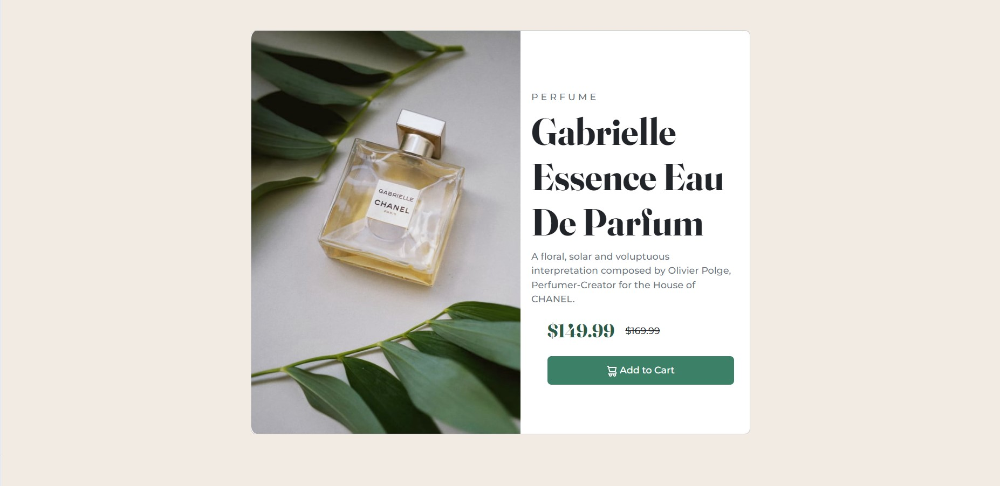
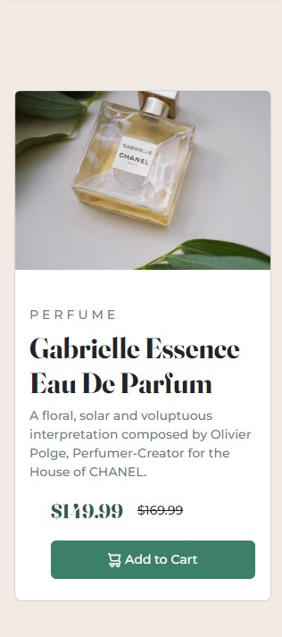

# FrontendMentor.io-projects
FrontEndMentor.io projects
# Product preview card component solution

This is a solution to the [Product preview card component challenge on Frontend Mentor](https://www.frontendmentor.io/challenges/product-preview-card-component-GO7UmttRfa). Frontend Mentor challenges help you improve your coding skills by building realistic projects. 

## Table of contents

- [Overview](#overview)
  - [The challenge](#the-challenge)
  - [Screenshot](#screenshot)
  - [Links](#links)
- [My process](#my-process)
  - [Built with](#built-with)
  - [What I learned](#what-i-learned)
  - [Continued development](#continued-development)
  - [Useful resources](#useful-resources)
- [Author](#author)
- [Acknowledgments](#acknowledgments)

**Note: Delete this note and update the table of contents based on what sections you keep.**

## Overview

### The challenge

Users should be able to:

- View the optimal layout depending on their device's screen size
- See hover and focus states for interactive elements

### Screenshot
PC view:

Mobile view:



### Links

- Solution URL: [FrontEnd Mentor Solution](https://www.frontendmentor.io/challenges/product-preview-card-component-GO7UmttRfa/hub/responsive-product-card-preview-t-cDngkKSX)
- Live Site URL: [GitHub Pages](https://szablitho.github.io/FrontendMentor.io-projects/)

## My process

### Built with

- Flexbox
- Mobile-first workflow
- [Bootstrap](https://getbootstrap.com/) - For responsivity and styles
- [CSS] - for making very specific styling or font change


### What I learned

For first time I've used picture tag.

```html
<picture>
      <source media="(max-width:991.9px)" srcset="images/image-product-mobile.jpg">
      <!-- classes applied here are designed for picture in mobile resolution, styling for PC is above in @media query -->
      
    </picture>
```
For this project, i had to use this for styling img in bigger screens.
```css
@media only screen and (min-width:992px) {
      .prod_pic {
        border-top-left-radius: 2% !important;
        border-top-right-radius: 0 !important;
        border-bottom-left-radius: 2% !important;
        border-bottom-right-radius: 0 !important;
      }
    }
```
Here is how use of Bootstrap looks from my hands. I'm proud of it.
```html / Bootstrap
  <div class="card d-lg-flex flex-lg-row col-sm-12 col-lg-8 col-xl-8 col-xxl-6 bg-white mt-3 mb-5 me-3 ms-3 rounded-3 height">
  <!-- card head -->
    <div class="flex-grow-1">
      <!-- flex-grow-1 makes on both children of flexbox equal to each other -> grow in 1:1 ratio-->
      <!-- col-lg-5 col-xl-4 col-xxl-1 -->
      <!-- these were applied but without them its all fitting perfectly in 1:1 ratio -->
    </div>
  <!-- card body -->
    <div class="col-lg-5 col-xl-4 col-xxl-5 align-self-center mt-3 me-3 ms-3 pb-4 flex-grow-1">
      <p class="product-name mt-4 lead text text-muted">PERFUME</p>
      <h1 class="display-4"> Gabrielle Essence Eau De Parfum</h1>
      <p class="text-muted"> A floral, solar and voluptuous interpretation composed by Olivier Polge, 
        Perfumer-Creator for the House of CHANEL.</p>
      <div class="container-fluid col-2-auto flex-wrap d-flex align-items-center mt-3 mb-md-3 mb-xxl-0 ms-4 me-2">
        <p class="actualPrice fs-3 me-3">$149.99</p>
        <p class="text-decoration-line-through"> $169.99</p>
      </div>
    </div>
  </div>
```


If you want more help with writing markdown, we'd recommend checking out [The Markdown Guide](https://www.markdownguide.org/) to learn more.


### Continued development
Making image fit isn't comfortable to me. I always try all the CSS properties to get my goal.
I still don't get sizing through bootstrap classes in cases where 2 children elements has to be equal. In Bootstrap maximum width is 12 units
```html
  <div class="col-12"> </div>  
```
When i match 2 children to have 6 unit per each, they are not equal. 
Besides that, i need practise with making responsive layouts, hidden/appearing on click navigation bars, learning specifity.
I also would like to start making dynamic pages with few JS functions.


### Useful resources

- [Bootstrap docs](https://getbootstrap.com/docs/5.2/getting-started/introduction/) - This helped me multitple times to get what classes do, how to apply them or when looking for CSS reference. This project was first where i use Bootstrap and i'm going to use it forward since it's easy and docs are clear.
- [CSS course](https://www.youtube.com/watch?v=G3e-cpL7ofc) - I got FlexBox and grid concepts from this course.


## Author

- Website - [Wiktor Szablewski](https://github.com/Szablitho)
- Frontend Mentor - [@Szablitho](https://www.frontendmentor.io/profile/Szablitho)


## Acknowledgments

Thank you for feedback [Lucas](https://www.frontendmentor.io/profile/correlucas) for showing me <picture> tag for making multiple image switcher, because my CSS could be confusing for some engines, like you said.

